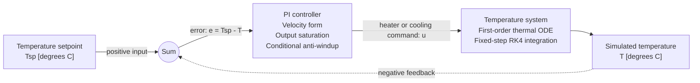

# Temperature Simulation Design

## 1. Purpose

This document describes the initial closed-loop temperature simulation used to:

1. Validate the C compilation and execution workflow.
2. Generate representative steady-state temperatures for later monitor tests.

The simulation initially remains independent of the ADC, EEPROM, GPIO, timer,
temperature-classification, and LED-control requirements.

## 2. Closed-Loop Block Diagram

The PI controller calculates the actuator command from the temperature error.
The simulated plant temperature is returned as negative feedback and exposed
as the simulation output.

## 3. PI Controller

### 3.1 Velocity form

The controller uses the discrete velocity, or incremental, PI form:

$$
u_k^* =
u_{k-1}
+ K_p(e_k-e_{k-1})
+ K_i T_s e_k
$$

The temperature error is:

$$
e_k = T_{sp,k} - T_k
$$

where:

| Symbol | Meaning |
|---|---|
| $u_k^*$ | Proposed controller output at sample $k$ |
| $u_{k-1}$ | Previous applied controller output |
| $e_k$ | Current temperature error |
| $e_{k-1}$ | Previous temperature error |
| $K_p$ | Proportional gain |
| $K_i$ | Integral gain |
| $T_s$ | Controller sample interval |

### 3.2 Output saturation

The proposed controller output is limited to the actuator range:

$$
u_k = \operatorname{clamp}(u_k^*,u_{\min},u_{\max})
$$

A heater-only actuator normally uses $u_{\min}=0$. A bidirectional thermal
actuator can use a negative value for $u_{\min}$ to represent active cooling.

### 3.3 Conditional anti-windup

Conditional anti-windup prevents the integral action from driving the
controller farther into saturation.

The integral contribution is inhibited when:

- $u_k^*>u_{\max}$ and the error would increase the output; or
- $u_k^*<u_{\min}$ and the error would decrease the output.

The controller is allowed to update when the proposed output is within its
limits or when the error drives a saturated output back toward the valid
range.

## 4. Temperature System

### 4.1 First-order thermal model

The initial plant uses the first-order ODE:

$$
\frac{dT}{dt}
=
\frac{T_a + K_h u - T}{\tau}
$$

where:

| Symbol | Meaning |
|---|---|
| $T$ | Simulated system temperature |
| $T_a$ | Ambient temperature |
| $u$ | Heater or cooling command |
| $K_h$ | Actuator-to-temperature gain |
| $\tau$ | Thermal time constant |

For a constant actuator command, the equilibrium temperature is:

$$
T_{ss}=T_a+K_hu
$$

This model captures thermal inertia, actuator input, and heat exchange with
the environment without introducing unnecessary reactor-specific states.

### 4.2 Sub-ambient temperatures

A heater-only system with an ambient temperature of $20$ degrees C cannot
reach a steady-state temperature below $20$ degrees C.

Producing the required scenario below $5$ degrees C therefore requires one of:

- an ambient temperature below $5$ degrees C;
- an active cooling command;
- a bidirectional heating and cooling actuator; or
- direct injection of a sub-$5$ degrees C sensor value.

The implementation must make this physical assumption explicit.

## 5. RK4 Numerical Integration

For the ODE

$$
\frac{dT}{dt}=f(T,u)
$$

one fixed RK4 step of duration $h$ is:

$$
k_1=f(T_k,u_k)
$$

$$
k_2=f\left(T_k+\frac{h}{2}k_1,u_k\right)
$$

$$
k_3=f\left(T_k+\frac{h}{2}k_2,u_k\right)
$$

$$
k_4=f(T_k+hk_3,u_k)
$$

The state update is:

$$
T_{k+1}
=
T_k
+
\frac{h}{6}
\left(k_1+2k_2+2k_3+k_4\right)
$$

The initial implementation uses a fixed integration step. The step size and
simulation duration must provide adequate accuracy while allowing the system
to reach its specified steady-state tolerance.

## 6. Initial Function Interface

The first implementation exposes a self-contained function conceptually
equivalent to:

    double simulate_temperature_system(double setpoint_celsius);

The input is the desired temperature setpoint in degrees Celsius. The return
value is the final simulated temperature after the configured simulation
interval.

The function initially encapsulates:

- PI controller state;
- output saturation and anti-windup;
- thermal plant state;
- first-order state derivative;
- RK4 integration; and
- simulation timing.

The controller, plant, and solver can later be separated into independently
testable modules without changing their mathematical behavior.

## 7. Required Operating Regions

| Scenario | Required steady-state result |
|---|---:|
| Ts1 | $T_{s1}<5$ degrees C |
| Ts2 | $5\leq T_{s2}<85$ degrees C |
| Ts3 | $85\leq T_{s3}<105$ degrees C |
| Ts4 | $T_{s4}\geq105$ degrees C |

The exact setpoints and environmental parameters will be selected after
deciding whether the actuator supports active cooling.

## 8. Initial Scope

The first implementation validates:

- C compilation and linking;
- execution of the demonstration program;
- closed-loop PI behavior;
- controller saturation and anti-windup;
- RK4 integration; and
- thermal steady-state generation.

It does not yet implement:

- sensor-revision conversion;
- ADC digit generation;
- temperature classification;
- LED-state selection;
- EEPROM configuration;
- hardware timer behavior; or
- bare-metal interrupt handling.
