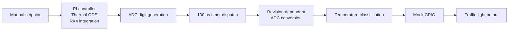

# Temperature Simulation Design

## 1. Purpose

The C and C++ demonstration executables contain a closed-loop thermal
simulation that generates a representative sensor temperature from a manually
entered setpoint.

The simulation is demonstration support. The PI controller, thermal model, and
RK4 solver are not part of the required temperature-monitoring logic.

## 2. Integrated Demonstration Flow



Before processing setpoints, the selected hardware revision and demonstration
serial number are written to mocked EEPROM through the I2C abstraction. The
configuration is then read back and used to select the ADC resolution.

## 3. PI Controller

The controller uses the incremental PI equation:

$$
u_k^*
=
u_{k-1}
+
K_p(e_k-e_{k-1})
+
K_i T_s e_k
$$

The temperature error is:

$$
e_k = T_{sp,k} - T_k
$$

The proposed controller output is limited to the configured actuator range:

$$
u_k
=
\operatorname{clamp}
\left(
u_k^*,
u_{\min},
u_{\max}
\right)
$$

The symbols are:

| Symbol | Meaning |
|---|---|
| $u_k^*$ | Proposed controller output |
| $u_k$ | Applied controller output |
| $e_k$ | Current temperature error |
| $e_{k-1}$ | Previous temperature error |
| $K_p$ | Proportional gain |
| $K_i$ | Integral gain |
| $T_s$ | Controller integration interval |

## 4. Thermal Model

The simulated plant uses the first-order ODE:

$$
\frac{dT}{dt}
=
\frac{T_a+u-T}{\tau}
$$

where:

| Symbol | Meaning |
|---|---|
| $T$ | Simulated plant temperature |
| $T_a$ | Ambient temperature |
| $u$ | Heating or cooling command |
| $\tau$ | Thermal time constant |

For a constant controller output, the equilibrium is:

$$
T_{ss}=T_a+u
$$

The negative controller-output limit models active cooling, allowing
temperatures below $5$ degrees Celsius to be demonstrated.

## 5. RK4 Integration

For the ODE:

$$
\frac{dT}{dt}=f(T,u)
$$

one fixed RK4 step of duration $h$ is:

$$
k_1=f(T_k,u_k)
$$

$$
k_2
=
f\left(
T_k+\frac{h}{2}k_1,
u_k
\right)
$$

$$
k_3
=
f\left(
T_k+\frac{h}{2}k_2,
u_k
\right)
$$

$$
k_4
=
f\left(
T_k+h k_3,
u_k
\right)
$$

The state update is:

$$
T_{k+1}
=
T_k
+
\frac{h}{6}
\left(
k_1+2k_2+2k_3+k_4
\right)
$$

## 6. Simulation Parameters

The C and C++ demonstrations use the same parameters:

| Parameter | Value |
|---|---:|
| Ambient temperature | $0$ degrees Celsius |
| Thermal time constant | $20$ seconds |
| Proportional gain | $2.0$ |
| Integral gain | $0.5$ |
| Integration step | $0.01$ seconds |
| Simulation duration | $200$ seconds |
| Minimum controller output | $-120$ |
| Maximum controller output | $120$ |
| Accepted setpoint range | $0$ to $120$ degrees Celsius |

The simulation runs faster than real time and returns the final plant
temperature after the configured simulation interval.

## 7. ADC Quantization

The final simulated temperature is converted into an ADC digit according to
the selected revision:

| Revision | Resolution | Example at $10$ degrees Celsius |
|---|---:|---:|
| Rev-A | $1.0$ degree Celsius per digit | 10 |
| Rev-B | $0.1$ degree Celsius per digit | 100 |

The conversion rounds to the nearest digit. Rev-A therefore reconstructs
whole-degree measurements, while Rev-B reconstructs measurements in tenths of
a degree.

Temperature classification operates on the reconstructed ADC measurement, not
directly on the unquantized simulation output.

## 8. Classification and Traffic Light

| Reconstructed temperature | Classification | LED |
|---|---|---|
| $T<5$ degrees Celsius | Critical | Red |
| $5\le T<85$ degrees Celsius | Normal | Green |
| $85\le T<105$ degrees Celsius | Warning | Yellow |
| $T\ge105$ degrees Celsius | Critical | Red |
| Invalid value | Invalid/fail-safe | Red |

Exactly one LED is active after a sample has been classified.

## 9. Sampling-Timer Model

The intended embedded sampling period is $100$ microseconds, corresponding to
$10$ kHz.

In the PC demonstrations, the timer does not create an asynchronous real-time
thread. One timer interrupt handler is invoked synchronously after each
accepted setpoint.

This deterministic dispatch demonstrates the software path but does not verify:

- Hard-real-time scheduling
- Interrupt latency
- Sampling jitter
- ADC conversion timing
- Electrical GPIO behavior

## 10. Executables

The simulation is integrated into both implementations:

```text
./build/c/c_temperature_simulation
./build/cpp/cpp_temperature_simulation
```

Each executable:

1. Requests Rev-A or Rev-B.
2. Stores the selected revision in mocked EEPROM.
3. Reads the configuration through mocked I2C.
4. Requests setpoints from $0$ to $120$ degrees Celsius.
5. Simulates the closed-loop thermal response.
6. Generates and reconstructs an ADC digit.
7. Classifies the reconstructed temperature.
8. Prints the resulting traffic-light state.

Enter `q` to stop the executable.

## 11. Scope Limitation

The simulation exists only to provide convenient manual inputs for the
temperature monitor. It is not intended to model a specific physical product,
prove control-system stability for production use, or demonstrate embedded
real-time performance.
